[](https://classroom.github.com/a/FuXjn4oO)
# Homework 3: Support Vector Machines (SVMs)

## Overview
In this homework, you will explore Support Vector Machines (SVMs), a classical machine learning method. 
You will implement and evaluate SVMs for both classification and regression tasks using real biomedical datasets. 
You will:

- Load and inspect biomedical datasets.
- Perform classification (heart disease).
- Perform regression (biological aging prediction).
- Compare linear, polynomial, and RBF kernels.
- Visualize decision boundaries and regression fits.

---

## Datasets

You will work with two datasets:
1. Heart Disease Dataset (Classification)
- **Goal**: Predict presence/absence of heart disease.
- **Features**: Demographics, cholesterol, ECG results, etc.

2. Biological Aging Dataset (Regression)
- **Goal**: Predict biological age using molecular and physiological features.
- **Source**: High-dimensional gene expression dataset (GSE139307).
- **Features**: Several hundred genomic and biological markers, already preprocessed and normalized.

---

## Installation

Install dependencies using pip:

1. **Clone** this repo (first time only):
   ```bash
   git clone git@github.com:brown-csci1851/stencil.git
   cd stencil/homework3
   ```
   If you already cloned it, update and move into the homework folder:
   ```bash
   cd stencil
   git pull
   cd homework3
   ```
2. Create virtual environment:
    ```bash
    python -m venv .hw3
    ```
3. Install dependencies:
    ```bash
    source .hw3/bin/activate (Linux/MacOS) or .\.hw3\Scripts\activate
    pip install -r requirements.txt
    ```

After creating and activating the virtual environment, select it as the Jupyter kernel in `src/playground.ipynb` to run the notebook using the same installed dependencies.

---

## Tasks

You will complete the following and include them in your reflection:

- [ ] Load both datasets using `HW3DataLoader`.
- [ ] Inspect the datasets (shapes, missing values, feature distributions, class balance).
- [ ] Build **leakage-free Pipelines** that include: imputation → scaling → (optional PCA) → SVM/SVR.
- [ ] Explain SVM intuition: **margin vs. slack (C)**, **kernels (linear / polynomial / RBF)**, and **why scaling matters**.
- [ ] Train and tune **SVM classifiers** (heart disease) with:
  - [ ] Linear kernel
  - [ ] Polynomial kernel (tune degree)
  - [ ] RBF kernel (tune γ)
- [ ] Evaluate classification using metrics such as:
  - [ ] Accuracy, F1
  - [ ] ROC-AUC or PR-AUC
  - [ ] Confusion matrix + ROC/PR curve
- [ ] Handle missing values in the aging dataset using **column-wise mean imputation** (do not drop rows/cols).
- [ ] Train and tune **SVR regressors** (biological aging) with linear / polynomial / RBF kernels.
- [ ] Evaluate regression using:
  - [ ] MAE, RMSE, $R^2$
  - [ ] Parity plot (predicted vs actual) + residual plot
- [ ] Show hyperparameter effects with visuals (examples: performance vs. C, γ, polynomial degree).
- [ ] Compare kernels and summarize which worked best for each task.

## Final Reflection

You will then write a **2–3 page PDF reflection** that includes **figures** and **interpretation** of your results. Your write-up should clearly reference the plots, tables, and metrics you generated (not just final numbers). 

- **Data & preprocessing:** what features you used, missingness, scaling, PCA choice (if used).

For the heart dataset I did not do any additional preprocessing but in the model pipeline I inlcuded standard scaling and mean imputation. After parameter tuning I ended up using 10 out of the 13 features. 

For the aging dataset I performed feature selection because this dataset has high feature dimensionality (485516 features), especially compared to only 37 data entries. I performed mean imputation and feature selection based on variance and established a threshold variance of 1e-3. This reduced the feature set to 129306, about a 3.75x reduction. Again, the pipeline for the regression model included mean imputation and standard scaling.  

- **Modeling & hyperparameters:** which kernel/params worked best for classification vs regression, and why.

 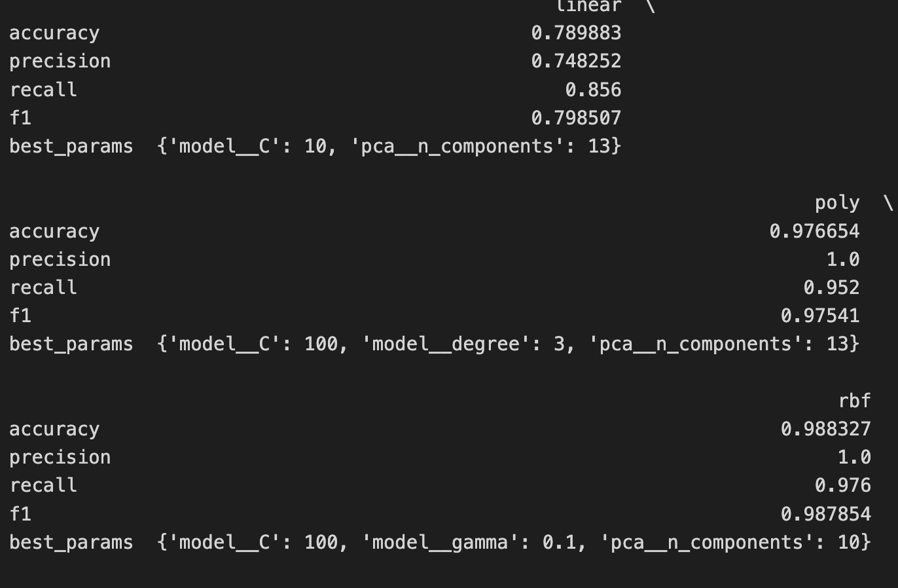 
For classification with the heart dataset rbf and polynomial kernels both performed well but rbf slightly outperformed the polynomial kernel. 
The polynomial kernel with best parameters (`C`=100, `degree`=3, `n_components`=13) had accuracy of 0.98, precision of 1.0, recall of 0.95, and f1 of 0.98. The rbf kernel with best parameters (`C`=100, `gamma`=0.1, `n_components`=10) had accuracy of 0.99, precision of 1.0, recall of 0.98, and f1 of 0.99. 
This is likely because the dataset is nonlinear, and on this relatively small dataset, with proper parameter tuning, they are able to find similar approximations of the data.

For regression with the reduced feature (129306) aging dataset, the linear kernel performed the best by far. The linear kernel had a mae of 3.74, mse of 20.4, and r2 of 0.28 compared to mae of polynomial (6.52) and rbf (7.54), mse of polynomial (45.4) and rbf (60.2), and r2 of polynomial (-0.60) and rbf (-1.13).This finding is likely a result of the very small dataset (37 examples) and high feature dimensionality. Simple linear kernels learn a global linear relationship in the data which seems to generalize well with a small dataset. Meanwhile, rbf and polynomial kernels introduce more flexibility in the model. This likely caused the model to memorize or fit noise in the training data, causing overfitting as seen in the poor evaluation metrics. 
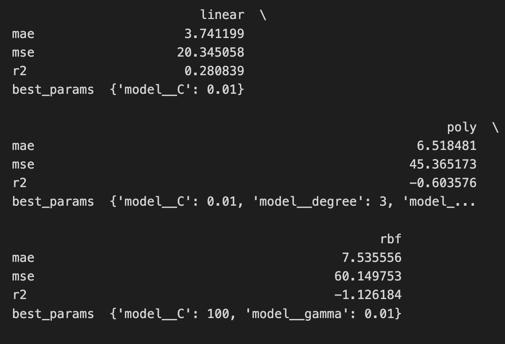

- **Metrics & visuals:** include key scores + confusion matrix/ROC/PR (classification) and parity/residuals (regression).

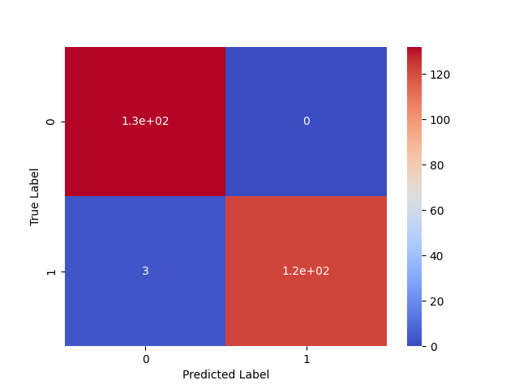

The confusion matrix for the heart dataset reflects the strong performance of the rbf kernel SVM model with 3 false negative predictions. While false negatives are not ideal in a healthcare domain especially with heart disease prediction, the high metrics are reassuring albeit on a small dataset though. 

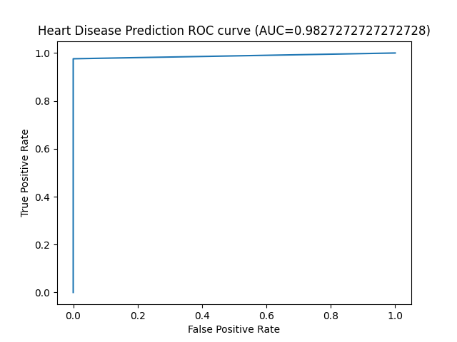

The rbf kernel SVM model achieved an AUC of 0.98 indicating particularly strong performance. The sharp corner in the graph depicts a high true positive rate while maintaing a small false positive rate. Such a high AUC is sometimes suspicious but I did not notice any data leakage so the nonlinear rbf kernel may simply be able to fit the smaller dataset well especially with tuned parameters. 

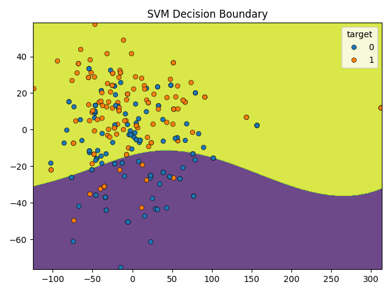

This image depicts the svm decision boundary of the nonlinear rbf kernel. The function first performs pca dimentionality reduction to project the decision boundary in two dimensions (retaining the top two principal components). There is some overlap between classes, indicating potential feature overlap between classes or variability in human risk factors. 


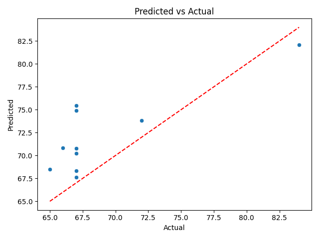

The regression results indicate a tendency to overestimate younger ages (65-75) and to underestimate older ages (based on the one older (> 82) test point). Almost half the test points lay near the true fit line, indicating a moderate performance (0.28 R2 score). 

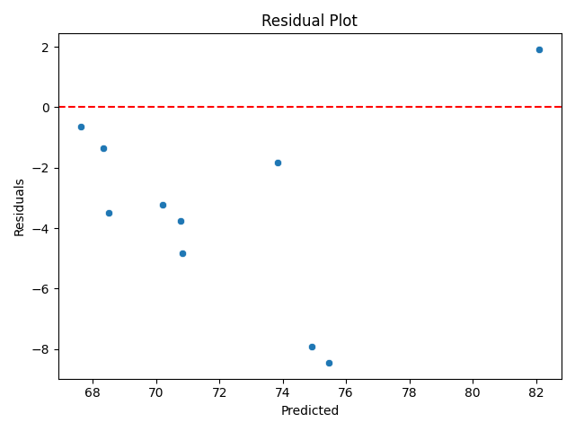

The residual plot shows many outliers (points far from the y=0 line), indicating that the linear svm regression model does not fit particularly well. However, considering the small number of examples in the dataset compared to the large number of features and that there are about 4 points that lay somewhat near the line, this performance may be sufficient. Ideally there would be more points clustered around the y=0 line though. 

- **Sensitivity:** how results changed with scaling/PCA and with C/γ/degree.

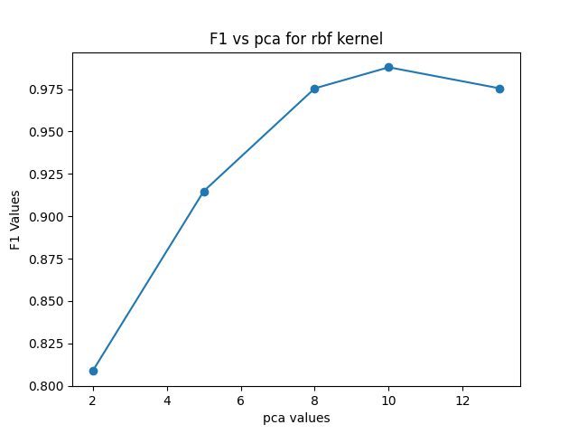

This figure depicts how F1 values change over different `n_component` values for PCA while using the aforementioned best parameters for the rbf kernel from parameter tuning. Performance steadily increases as the number of components increases, reaching a peak at `n_component` = 10 and then slightly dips when all of the original features (`n_component`=13) are included. This is likely due to some features having weak predictive value or being redundant. Removing these reduntant or irrelevant features enables the models to more clearly and efficiently identify meaningful patterns in the data. Conversely, having too few features hurts performance by removing important infromation. 

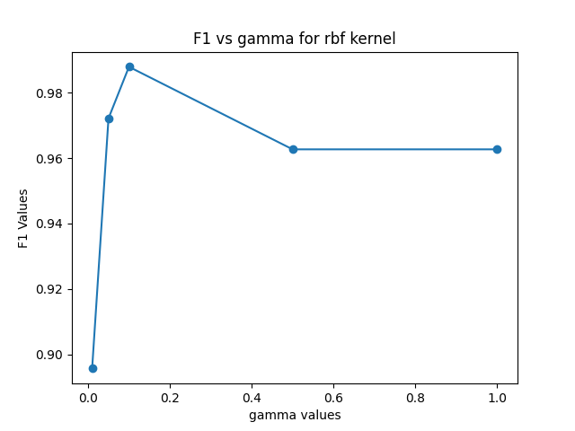

This figure depicts how F1 values change over different `gamma` values with the rbf kernel. The performance line drastically increases from gamma values of 0.01 to 0.05 and peaks at 0.1 (F1 > 0.98). F1 score then declines to around 0.96 for the remaining values (0.5 and 1.0). The peak `gamma` value 0.1 balances fitting the training data while maintaining a fairly smooth decision boundary for good generalization performance. Larger gamma values tend to overfit while smaller values often underfit which explains the trend in the figure. 


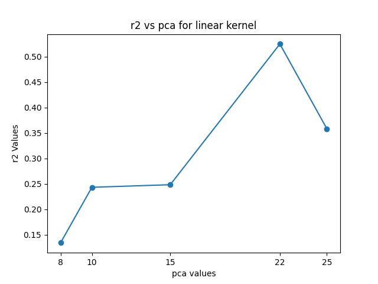

This figure depicts how R2 values change across different PCA `n_component` values for the linear kernel SVM on the aging dataset. The peak R2 score is around 0.50 when `n_component` = 22. In comparison the next closest R2 values in the figure are ~0.25 and ~0.35, so a score ~0.50 is a large improvement. Additionally it is an improvement on the R2 value of the linear kernel SVM model (0.28) with tuned best parameters after feature selections (num_features = 129306). This suggests that even after reducing the number of features with variance based feature selection, there is still some redundancy or weak predictive features that pca dimensionality reduction helps rectify. Out of curiosity I plotted the regression and residual results with the new linear kernel SMV model with `C`=0.01 and `n_components`=22. 

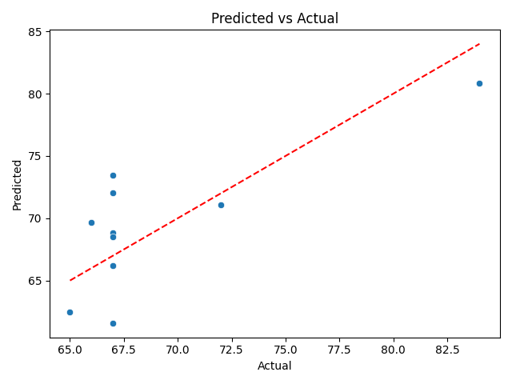

The model still underestimates the older age point but is more accurate with the younger ages and no longer consistently overpredits the younger ages. This is an improvement on the original model as seen with more points lying closer to the best fit line. 

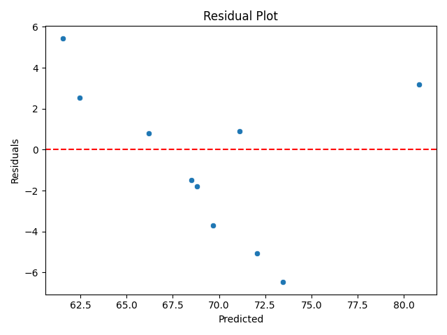

There are fewer outliers and more points are clustered around the y=0 line indicating a better model performance. Additionally the points are more spread out on either side of the y=0 side indicating an absence of strong trends in the model. 
---


## Expected Skills

By the end of this homework, you should be able to:

* Use SVMs for both classification and regression.
* Understand kernel functions and their role in SVMs.
* Visualize and interpret decision boundaries and predictions.
